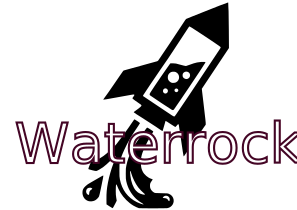
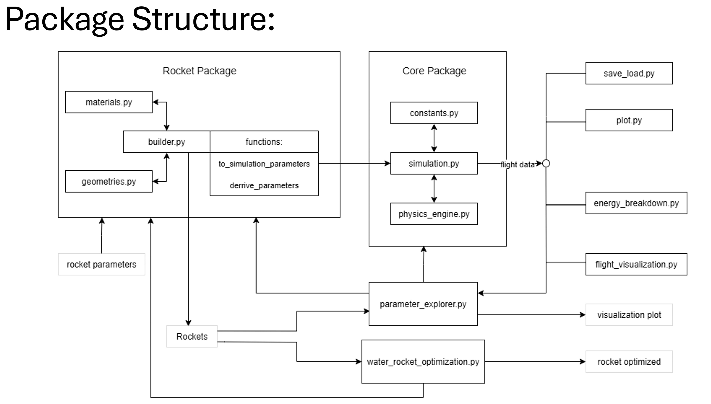

# WaterRocketPy 
[](https://pypi.python.org/pypi/waterrocketpy)
[](https://github.com/Cube002/waterrocketpy/actions)
[](https://pypi.org/project/waterrocketpy/)
[](LICENSE)




**The Python package for water rocket simulation, analysis, and optimization.**

WaterRocketPy provides a complete toolkit for modeling the physics of water rockets, from initial pressurization through thrust phase, ballistic flight, and landing. Whether you're an educator, student, hobbyist, or researcher, this package offers both simple interfaces for quick simulations and advanced tools for detailed analysis.

## Key Features

### Core Simulation Engine
- **Physics-Based Modeling**: Accurate simulation of water rocket flight dynamics including:
  - Water and air mass flow through nozzle
  - Pressure dynamics during thrust phase
  - Aerodynamic drag during ballistic phase
  - Temperature effects on air expansion
- **Multiple Integration Methods**: Support for various numerical solvers (RK45, RK23, etc.)
- **Complete Data Output**: Time series data for altitude, velocity, acceleration, pressure, temperature, mass flow rates, and more

### Rocket Configuration & Building
- **Flexible Rocket Builder**: Create custom rocket configurations with various bottle sizes, nozzle designs, and materials
- **Material Database**: Built-in material properties for common bottle materials (PET, HDPE, etc.)
- **Standard Configurations**: Pre-defined rocket configurations for quick prototyping

### Advanced Analysis Tools
- **Parameter Explorer**: Multi-dimensional parameter sensitivity analysis
- **Energy Breakdown**: Detailed energy flow analysis throughout flight phases to see where energy gets lost
- **Flight Phase Detection**: Automatic identification of water/air thrust, ballistic, and descent phases

### Optimization Capabilities
- **Multi-Objective Optimization**: Optimize for maximum altitude, velocity, or flight time
- **Constraint Handling**: Physical and practical constraints on rocket parameters
- **Multiple Algorithms**: Support for differential evolution, minimization methods, and custom optimization strategies

### Rich Visualization
- **Comprehensive Plotting**: Pre-built plotting functions for all flight parameters
- **Flight Animation**: Animated trajectory visualization (for education)
- **Batch Analysis**: Compare multiple simulation runs with organized plot outputs, 3D apogee landscapes and more

## Installation

### From PyPI (Recommended)
```bash
pip install waterrocketpy
```

### From Source
```bash
git clone https://github.com/Cube002/waterrocketpy.git
cd waterrocketpy
pip install -e .
```

### Dependencies
- Python ≥ 3.8
- NumPy: Numerical computations
- SciPy: ODE solving and optimization
- Matplotlib: Visualization and plotting

## Quick Start

### Basic Simulation
```python
from waterrocketpy.core.simulation import WaterRocketSimulator
from waterrocketpy.rocket.builder import RocketBuilder,RocketConfiguration,create_standard_rocket

#Build
rocket = create_standard_rocket()
rocket_sim_params = rocket.to_simulation_params() #Eport to simulation Parameters
#Simulate
simulator = WaterRocketSimulator()
flight_data = simulator.simulate(rocket_sim_params)

print(f"Maximum altitude: {flight_data.max_altitude:.2f} m")
```

### Using the Rocket Builder
```python
from waterrocketpy.rocket.builder import RocketBuilder
from waterrocketpy.core.constants import ATMOSPHERIC_PRESSURE
from waterrocketpy.core.simulation import WaterRocketSimulator
# Smart approach - specify dimensions, let the function calculate everything!
smart_builder = RocketBuilder()

smart_config = (smart_builder
    .build_from_dimensions(
        L_body=0.25,           # 25 cm body length
        L_cone=0.08,           # 8 cm nose cone length  
        d_body=0.088,          # 88 mm diameter (standard 2L bottle)
        p_max=8 * ATMOSPHERIC_PRESSURE,  # 8 bar maximum pressure
        nozzle_diameter=0.01,  # 10 mm nozzle diameter
        material_name="PET",   # PET plastic material
        water_fraction=0.3,    # 30% water fill
        safety_factor=2.0      # 2x safety factor
    )
    .set_metadata("Smart Rocket", "Built using build_from_dimensions")
    .build()
)

print("Smart Rocket Configuration:")
print(f"  Volume: {smart_config.bottle_volume:.6f} m³")
print(f"  Empty Mass: {smart_config.empty_mass:.3f} kg")
print(f"  Drag Coefficient: {smart_config.drag_coefficient:.3f}")
print(f"  Description: {smart_config.description}")
#simulate
simulator = WaterRocketSimulator()
flight_data = simulator.simulate(smart_config.to_simulation_params())
print(f"Maximum altitude: {flight_data.max_altitude:.2f} m")
```
## Advanced Examples:
### Parameter Optimization
https://Cube002.github.io/waterrocketpy/examples/simple_optimization_example/

https://Cube002.github.io/waterrocketpy/examples/advanced_optimization_example/
### Detailed Flight Analysis
https://Cube002.github.io/waterrocketpy/examples/flight_data_visualization/
### Parameter Sensitivity Analysis
https://Cube002.github.io/waterrocketpy/examples/parameter_explorer_example/
### Batch Processing & Comparison
https://Cube002.github.io/waterrocketpy/examples/batch_comparison/

## Package Structure
```
waterrocketpy/
├── core/                    # Core simulation engine
│   ├── physics_engine.py    # Physics calculations
│   ├── simulation.py        # Main simulator
│   ├── constants.py         # Physical constants
│   └── validation.py        # Parameter validation
├── rocket/                  # Rocket configuration tools  
│   ├── builder.py           # Rocket builder classes
│   ├── geometry.py          # Geometric calculations
│   └── materials.py         # Material properties
├── optimization/            # Optimization algorithms
│   └── water_rocket_optimizer.py
├── visualization/           # Plotting and visualization
│   ├── plot_flight_data.py  # Flight data plots
│   ├── parameter_explorer.py # Parameter analysis
│   └── flight_animation.py  # Animated visualizations
├── analysis/                # Advanced analysis tools
│   ├── energy_breakdown.py  # Energy flow analysis
│   └── energy_breakdown_plot.py
└── utils/                   # Utilities
    ├── loader.py            # Data loading
    └── saver.py             # Data saving
```


## Included Examples

The package includes numerous example scripts in the `examples/` directory:

### Core Examples
- `use_basic_functionality.py` - Basic simulation setup and execution
- `main.py` - Simple example with plotting

### Visualization Examples  
- `use_plot_flight_data.py` - Comprehensive flight data visualization
- `use_basic_functionality_animate.py` - Animated flight trajectories

### Analysis Examples
- `use_parameter_explorer_simple.py` - Parameter sensitivity analysis
- `use_parameter_explorer_multiple_Parameters.py` - Multi-parameter exploration

### Optimization Examples
- `use_water_rocket_optimizer.py` - Rocket design optimization

## Physics Model

The simulation engine models the complete water rocket flight profile:

1. **Water Thrust Phase**: Water expulsion under pressure
   - Bernoulli's equation for flow rate
   - Adiabatic expansion of compressed air
   - Temperature effects on gas properties

2. **Air Thrust Phase**: Water expulsion under pressure
   - Time step wise Bernoulli's equation for flow rate
   - (Sonic) exhaust of compressed air through a Converging or Converging Diverging Nozzle

3. **Ballistic Phase**: Unpowered flight
   - Gravitational acceleration
   - Aerodynamic drag (quadratic)
   - Air density variation with altitude

4. **Landing Phase**: Impact detection and final state

Key physical relationships implemented:

- Implicit Conservation of mass energy and momentum
- Ideal gas law with temperature corrections
- Compressible flow through nozzles
- Standard atmosphere model
- Aerodynamik drag based on modelrocket data

## Output Data

Each simulation provides comprehensive time-series data:

- **Trajectory**: altitude, velocity, acceleration
- **Propulsion**: thrust, mass flow rates (water/air), exhaust velocities
- **Thermodynamics**: pressure, temperature, gas masses
- **Forces**: drag force, net force
- **Performance**: phase identification, peak values, flight time

## Contributing

I welcome contributions! Please see the [contributing guidelines](CONTRIBUTING.md) for details on:
- Bug reports and feature requests
- Code contributions and pull requests  
- Documentation improvements
- Example submissions

## License

This project is licensed under the MIT License - see the [LICENSE](LICENSE) file for details.

## Acknowledgments

- Physics models based on established fluid dynamics principles from the book to the lecture Fluidmechanik (Aachener Beiträge zur Strömungsmechanik) ISBN 978-3-95886-221-0
- Thanks Jonathan for helping with the core physics model

## Links

- **Documentation**: https://Cube002.github.io/waterrocketpy
- **PyPI Package**: https://pypi.org/project/waterrocketpy/
- **Source Code**: https://github.com/Cube002/waterrocketpy
- **Issue Tracker**: https://github.com/Cube002/waterrocketpy/issues

---

*Ready to launch your water rocket simulations? Install WaterRocketPy today and start exploring the physics of water propulsion before building your own PET-Bottle Waterrocket and becoming as fascinated as me :D*
