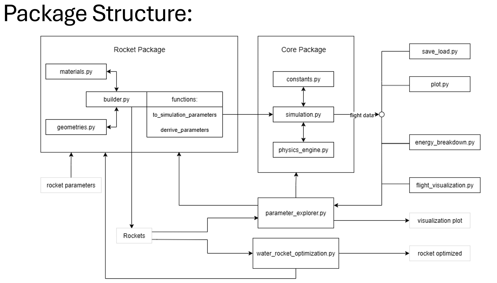

# Welcome to waterrocketpy

**A modular Python package for simulating water rockets.**

-   Free software: MIT License
-   Documentation: <https://Cube002.github.io/waterrocketpy>
    

## Features

with this package you can create a water rocket simulation.
there are following modules:
- core: contains the main simulation logic
- rocket: defines the rocket structure and components
- analysis: provides tools for analyzing simulation results
- utils: utility functions and classes for saving/loading data
- visualization: tools for visualizing simulation data
- optimization: tools for optimizing rocket parameters

